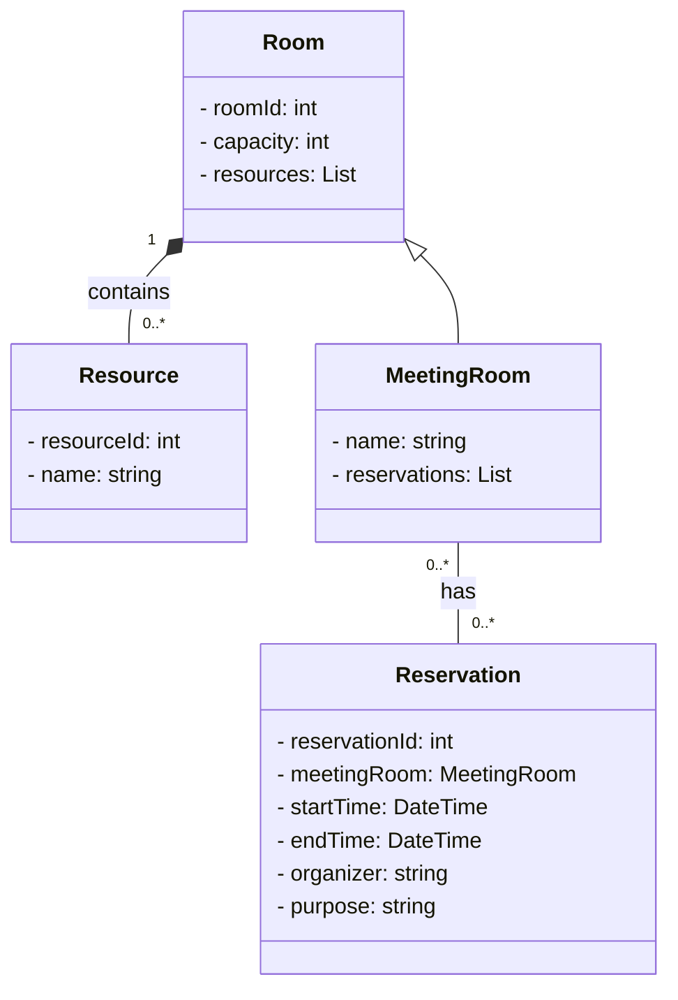

# Sistema de Reserva de Salas de Reunião

## Funcionalidades Principais

- [ ] **Visualizar Salas Disponíveis**: Os usuários podem visualizar todas as salas de reunião disponíveis, juntamente com detalhes como capacidade, recursos (projetor, quadro branco, etc.) e horários disponíveis.
- [ ] **Reservar Sala de Reunião**: Permitir que os usuários reservem uma sala de reunião para um horário específico, fornecendo detalhes como data, hora de início, hora de término e motivo da reunião.
- [ ] **Editar Reserva**: Capacidade de editar detalhes de uma reserva existente, como data, hora ou motivo da reunião.
- [ ] **Cancelar Reserva**: Opção para cancelar uma reserva existente de uma sala de reunião.
- [ ] **Notificações**: Implementar um sistema de notificações para lembrar os usuários sobre reservas pendentes e próximas.
- [ ] **Relatórios**: Gerar relatórios sobre o uso das salas de reunião, incluindo a frequência de uso, horários mais populares, etc.

## Regras de Negócio
- [ ] **Conflito de Reservas**: Não permitir que duas reservas se sobreponham no mesmo horário para a mesma sala de reunião.
- [ ] **Validação de Dados**: Todos os campos obrigatórios devem ser preenchidos ao fazer uma reserva.
- [ ] **Antecedência Mínima**: Definir uma antecedência mínima para fazer uma reserva (por exemplo, não é possível reservar uma sala com menos de 24 horas de antecedência).
- [ ] **Acesso Seguro**: Implementar autenticação e autorização para garantir que apenas usuários autorizados possam fazer reservas ou cancelá-las.
- [ ] **Feedback de Confirmação**: Fornecer feedback claro para os usuários após fazerem uma reserva ou cancelarem uma reserva.

## Diagrama de classes

Neste diagrama, temos as seguintes classes:

- **Room**: Representa uma sala genérica, com sua capacidade e recursos disponíveis.
- **Resource**: Representa um recurso que pode estar presente em uma sala de reunião, como um projetor, quadro branco, etc.
- **MeetingRoom**: Uma subclasse de Room, representa uma sala de reunião específica com suas reservas.
- **Reservation**: Representa uma reserva de uma sala de reunião, incluindo informações como sala reservada, horário, organizador e propósito da reunião.
